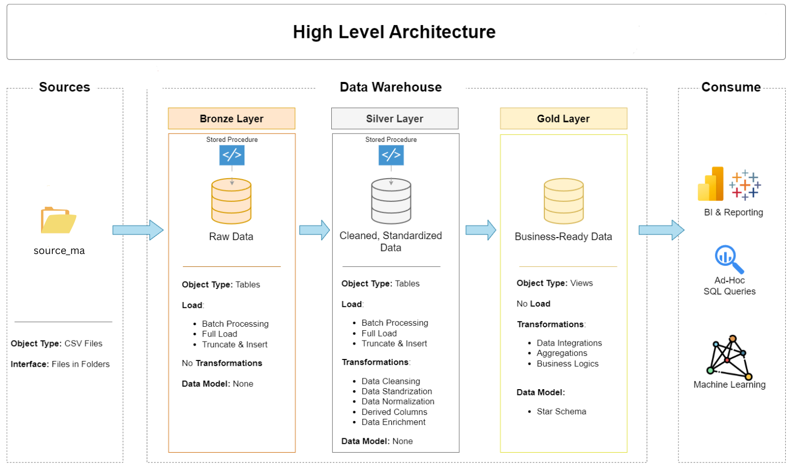
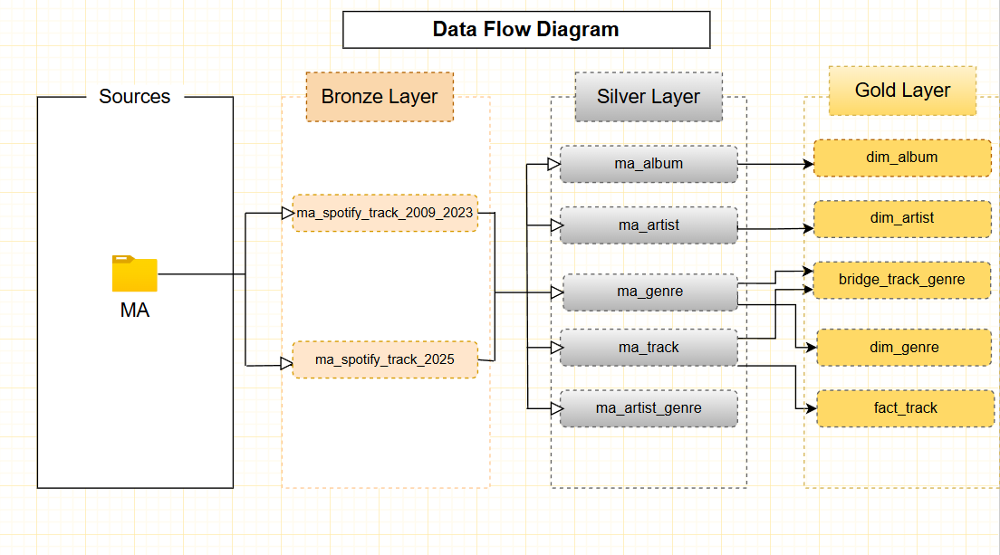

# Spotify Data Warehouse project
This project implements a modern Spotify Music Analytics Data Warehouse.
It ingests, cleans, transforms, and models Spotify track metadata spanning 2009–2023 and 2025, enabling analytics on artist popularity, track trends, genres, albums, and more.

---
## 🏗️ Data Architecture
The data architecture for this project follows Medallion Architecture **Bronze**, **Silver**, and **Gold** layers:

## Data Flow Diagram
It shows how data flows from one layer to another.

**Note** - "MA" stands For "Music Analytics" Department. Which is dummy department made by me. So that i can mimic the departments in a organization.

## Project Status
1. Bronze Layer(Done)
2. Silver Layer(Done)
3. Gold Layer(Done)
4. Data Visualization(Power BI In Progress)

## Reference:
Data With Bara: https://www.youtube.com/@DataWithBaraa
